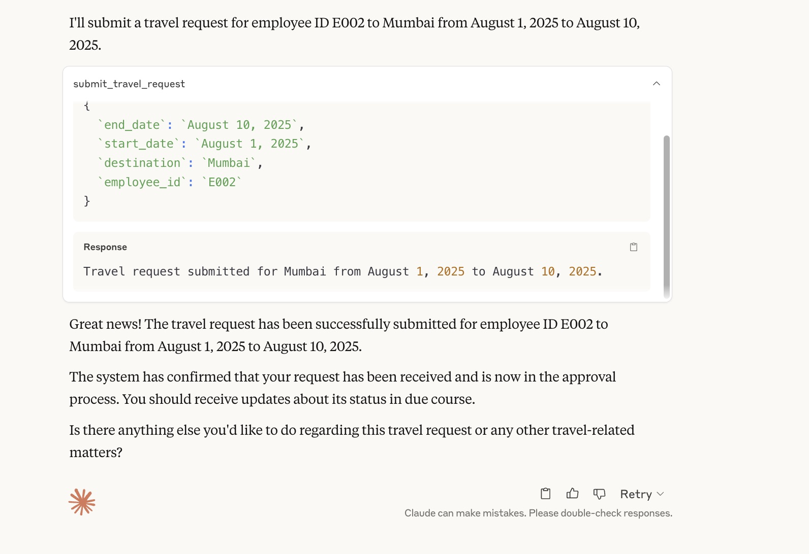

# MCP Travel Desk — A Minimal MCP Client & Server Demo

This is a simple repository that shows the process of building an **MCP server** and using **Claude Desktop as a client**. I have shown here a simple Travel Desk system to handle employee travel requests, approvals, and history tracking — all accessible directly from Claude. One can modify the contents of this repo to develop specific MCP use cases.

---

##  Setup Instructions

### 1. Install Claude Desktop
Download and install Claude Desktop from [Anthropic](https://www.anthropic.com). This acts as your **MCP client**.

---

### 2. Install MCP Python SDK

```bash
pip install mcp
```
### 3. Install uv (Python Package Manager)

```bash
pip install uv
```
On macOS, if this fails:
```bash
brew install uv
```
### 4. Initialize MCP Server
```bash
uv init
```
### 5. Create main.py
append the main.py code in the repo
### 6. Install the Server into Claude
```bash
uv run mcp install main.py
```
This will:

Create a virtual environment (.venv)
Add your server to Claude config
Output logs like:
```bash
Added server 'TravelDesk' to Claude config
Successfully installed TravelDesk in Claude app
```
### 7. macOS Troubleshooting
If the server doesn't start in Claude:
Run: 
```bash
brew install uv
```
Restart Claude Desktop
Go to Claude → Developer Settings and ensure the server is Running

### 8. Use Claude as MCP Client
Claude reads the MCP config from .mcp/claude.json.
### 9. Tools Appear in Claude UI
Once installed, the following tools will be available inside Claude:

submit_travel_request
get_travel_history
approved_trips_count
greeting://{name}
### 10. Ask Queries via Claude
Try asking:
Submit a travel request for E001 to Paris from 2025-01-01 to 2025-01-05
How many approved trips does E002 have?
Get travel history for E001
greeting://Chaitanya




